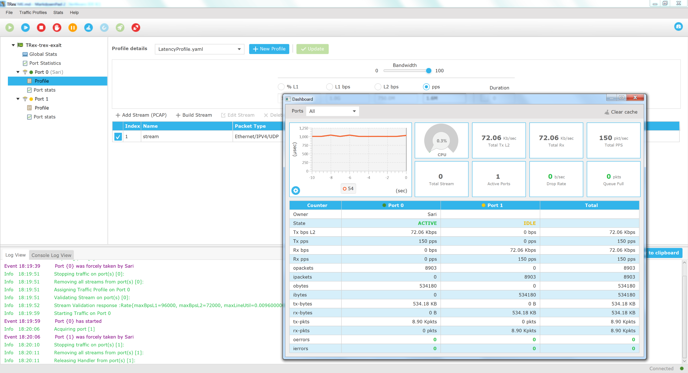
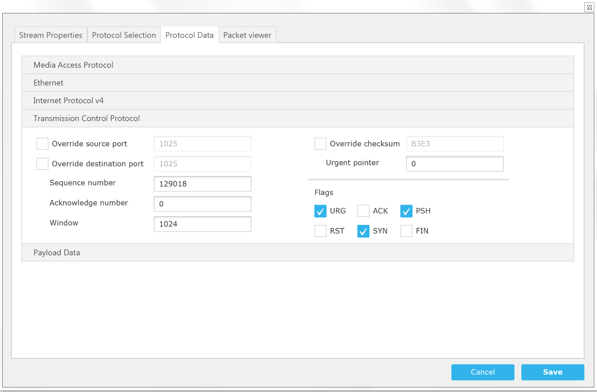
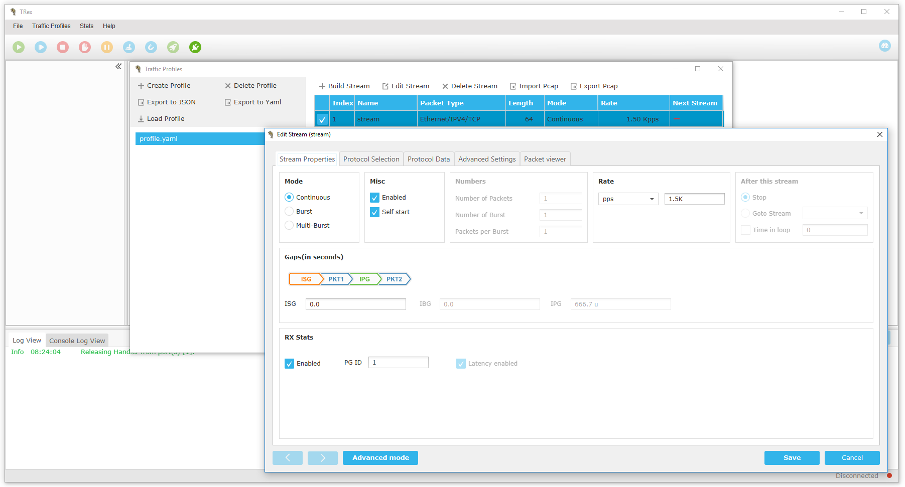
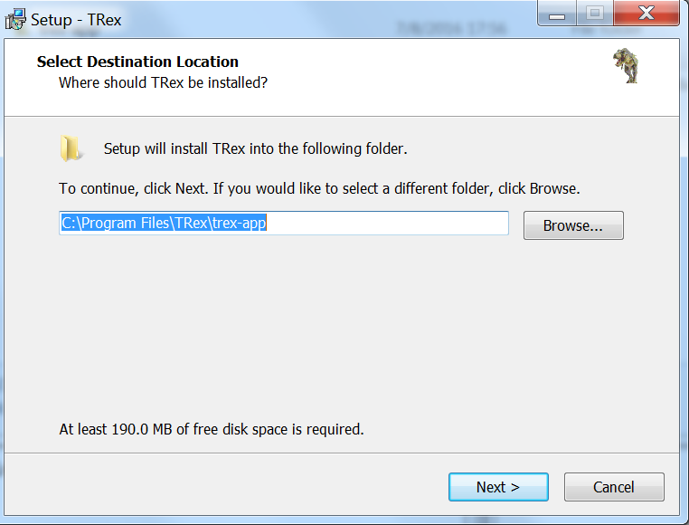
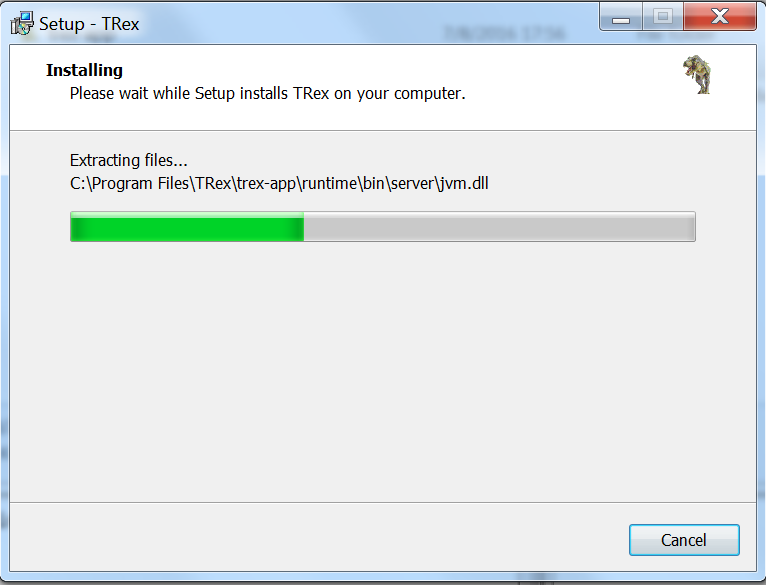

# TRex Stateless GUI *(Beta)*

TRex Stateless GUI application provides a graphical user interface for [TRex](https://trex-tgn.cisco.com/ "TRex").

## Description and main features:

TRex Stateless GUI application is a JavaFX based application.

 

The application main features can be split into two parts (TRex Management and Traffic Profile management):

### TRex Management

**Main Features**

This is an online part, you need to be connected to TRex in order to perform the following actions:

- Connect and manage TRex v2.05 and above.
- Ability to preview all ports along with their status and statistics.
- Ability to assign traffic to a specific port and start the traffic.
- Ability to update the bandwidth / update the multiplier options on the fly.
- Dashboard to view the latency chart, port details and Global Statistics.
- Logger view to preview server messages.
- Advanced logger view to see all the JSON requests sent to the server and server's responses. 

### Traffic Profile Management

Traffic Profile Management is an offline tool, you can use it without connecting to TRex server.

 

**Main Features**

- Ability to import existing YAML profiles / export them to JSON or YAML formats
- Ability to create a profile from scratch
- Ability to create one or more streams for a given profile.
- Ability to edit existing stream properties or create new ones.
- Ability to build a stream from existing PCAP file or from scratch (using advanced Stream builder).
- Ability to export a stream to PCAP format.

 

## Build a Native App

This section describes how to build a native application bundle (EXE for Windows and DMG for Mac).

1. `mvn clean jfx:native` (generates the native packaging using Maven).
2. Look for the the installer, DMG, or EXE in `(project)\target\jfx\native`.

This will build an installer for whatever platform you are building on. Building on a Mac will produce a Mac app. Building on a Windows PC will produce a Windows app.

## Building a Windows Installer and Native Application EXE

Building a Mac DMG or Windows EXE works straight of the box. However, Windows requires either WiX for MSI creation or Inno Setup for an EXE-based installer (both install an EXE for the JavaFX application along with a packaged JRE).

Both don't need to be installed, just whichever one gets you to your desired installer format.

### Build an EXE Installer with Inno Setup

Follow the steps below to create an EXE-based installer with Inno Setup and the JavaFX Maven plugin.

1. Download from [Inno Setup's site](http://www.jrsoftware.org/isinfo.php)
2. Install it (I defaulted most of the installation options)
3. Add `C:\Program Files (x86)\Inno Setup 5` to your system `Path` variable.

Once done, run `mvn jfx:native` to create an EXE based installer at `(project)\target\jfx\native`.

By running the EXE installer, it installs the JavaFX application to the user's local app data folder, as well as an uninstaller entry in the `Programs and Features` control panel. The application is also launched immediately following installation.

### Build an MSI with WiX

To install WiX and have the JavaFX Maven plugin use it during a build, do the following:

1. Download from [WiX's site](http://wixtoolset.org/)
2. Install it.
3. Add `C:\Program Files (x86)\WiX Toolset v3.10\bin` to your system `Path` variable.

Once that is complete, `mvn jfx:native` will create an MSI file in `(project)\target\jfx\native\bundles`.

Running the MSI installs the application to `C:\Program Files (x86)\(project name)` without prompt. Additionally, it creates an uninstaller listing in the `Programs and Features` control panel.

## Development environment and IDE

It is recommended to use NetBeans IDE 8.1 or above. There is no need to install any additional plugins. Simply import the project.

## Installation Wizard

To install TRex, double click the installer binary and follow the instructions to complete the installation setup.

 

 

## YouTrack

Report bug/request feature [YouTrack](http://trex-tgn.cisco.com/youtrack/issues)

##  Contact Us

Follow us on [TRex traffic generator google group](https://groups.google.com/forum/#!forum/trex-tgn)

##  Questions

You can use our [TRex forum](https://groups.google.com/forum/#!forum/trex-tgn) if you have any question.

##  Installer 

###  Windows Installer 

You can find our Windows Beta installer in the following link.

